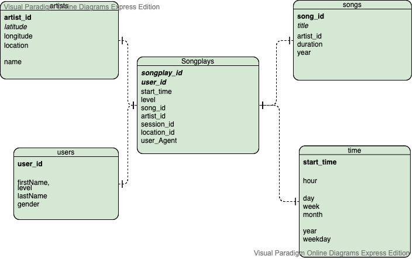

# Data Pipelines with Airflow
A music streaming company, Sparkify, has decided that it is time to introduce more automation and monitoring to their data warehouse ETL pipelines and come to the conclusion that the best tool to achieve this is Apache Airflow.

They have decided to bring you into the project and expect you to create high grade data pipelines that are dynamic and built from reusable tasks, can be monitored, and allow easy backfills. They have also noted that the data quality plays a big part when analyses are executed on top the data warehouse and want to run tests against their datasets after the ETL steps have been executed to catch any discrepancies in the datasets.

The source data resides in S3 and needs to be processed in Sparkify's data warehouse in Amazon Redshift. The source datasets consist of JSON logs that tell about user activity in the application and JSON metadata about the songs the users listen to.

## Project Description
This project will introduce you to the core concepts of Apache Airflow. To complete the project, you will need to create your own custom operators to perform tasks such as staging the data, filling the data warehouse, and running checks on the data as the final step.

## Getting started
To start
* Set AWS credentials in Airflow
On the create connection page, enter the following values:

Conn Id: Enter aws_credentials.
Conn Type: Enter Amazon Web Services.
Login: Enter your Access key ID from the IAM User credentials you downloaded earlier.
Password: Enter your Secret access key from the IAM User credentials you downloaded earlier.

* Set redshift connection in Airflow
Conn Id: Enter redshift.
Conn Type: Enter Postgres.
Host: Enter the endpoint of your Redshift cluster, excluding the port at the end. You can find this by selecting your cluster in the Clusters page of the Amazon Redshift console. IMPORTANT: Make sure to NOT include the port at the end of the Redshift endpoint string.
Schema: Enter dev. This is the Redshift database you want to connect to.
Login: Enter awsuser.
Password: Enter the password you created when launching your Redshift cluster.
Port: Enter 5439.

* From /opt/airflow, run ./start.sh to start Airflow web server

## Dag and Operators

- sparkify_etl_dag.py: This dag loads data from S3 into staging tables, populates fact and dimension tables
- data_quality.py: Operator to verify data quality
- load_dimension.py: Operator to load dimension tables
- load_fact.py: Operator to load fact table
- stage_redshift.py: Operator to copy stage data from S3

## Database Schema


- songplays: Records in log data associated with song plays
- users: Users in the app
- songs: Songs in music database
- artists: Artists in music database
- time: Timestamps of records in songplays broken down into specific units

## ETL Pipeline Details


### song_data ETL

#### Source dataset
Song data resides in S3 - s3://udacity-dend/song_data
Each file is in JSON format and contains metadata about a song and the artist of that song. The files are partitioned by the first three letters of each song's track ID. For example, here are filepaths to two files in this dataset.

`song_data/A/B/C/TRABCEI128F424C983.json
song_data/A/A/B/TRAABJL12903CDCF1A.json
`

And below is an example of what a single song file, TRAABJL12903CDCF1A.json, looks like.
```json
{
  "num_songs": 1,
  "artist_id": "ARJIE2Y34JH994AB7",
  "artist_latitude": null,
  "artist_longitude": null,
  "artist_location": "",
  "artist_name": "Joe Tayler",
  "song_id": "SE567HG8999HHG",
  "title": "Der Kleine Dompfaff",
  "duration": 68.98,
  "year": 1980
}
```

### log_data ETL

#### Source dataset
Data resides in S3
Log data: s3://udacity-dend/log_data
Log data json path: s3://udacity-dend/log_json_path.json

The log files are partitioned by year and month. For example, here are filepath in this dataset.

`log_data/2018/11/2018-11-01-events.json
`

And below is an example of what the data in a log file, 2018-11-12-events.json, looks like.
```json
{
  "artist": "Pavement",
  "auth": "Logged In",
  "firstName": "Sylvie",
  "gender": "F",
  "itemInSession": 0,
  "lastName": "Cruz",
  "length": 109.1683,
  "level": "free",
  "location": "San Francisco, CA",
  "method": "PUT",
  "page": "NextSong",
  "registration": 7867266185796.0,
  "sessionId": 775,
  "song": "Mercy:The Laundromat",
  "status": 200,
  "ts": 257890258796,
  "userAgent": "\"Mozilla/5.0 (Macintosh; Intel Mac OS X 10_9_4) AppleWebKit/537.77.4 (KHTML, like Gecko) Version/7.0.5 Safari/537.77.4\"",
  "userId": "10"
}
```

#### Final tabes
Fact Table

* songplays - records in log data associated with song plays i.e. records with page NextSong

   **  _songplay_id, start_time, user_id, level, song_id, artist_id, session_id, location, user_agent_

Dimension Tables

* users - users in the app

   ** _user_id, first_name, last_name, gender, level_

* songs - songs in music database

   ** _song_id, title, artist_id, year, duration_

* artists - artists in music database

    ** _artist_id, name, location, latitude, longitude_

* time - timestamps of records in songplays broken down into specific units

    ** _start_time, hour, day, week, month, year, weekday_


REFERENCE
* https://docs.aws.amazon.com/redshift/latest/dg/r_COPY_command_examples.html
* https://airflow.apache.org/docs/stable/scheduler.html
* https://airflow.apache.org/docs/stable/macros.html
