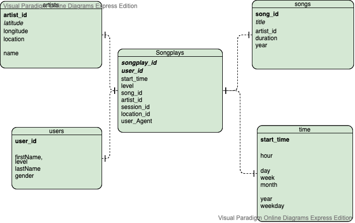

# Data Lake using Spark

## Introduction
A music streaming startup, Sparkify, has grown their user base and song database and want to move their data warehouse to a data lake. Their data resides in S3, in a directory of JSON logs on user activity on the app, as well as a directory with JSON metadata on the songs in their app.

Their data engineer is tasked with building an ETL pipeline that extracts their data from S3, processes them using Spark, and loads the data back into S3 as a set of dimensional tables. This will allow their analytics team to continue finding insights in what songs their users are listening to.

## Project Description
In this project, I'll apply what I've learned on Spark and data lakes to build an ETL pipeline for a data lake hosted on S3. To complete the project, I will need to load data from S3, process the data into analytics tables using Spark, and load them back into S3. I'll deploy this Spark process on a cluster using AWS.

## Getting started
To start ETL process, run the following from your terminal.
`Set AWS credentials in dl.cfg`
`python etl.py`

## Python scripts and Jupyter notebooks
- etl.py: Read JSON logs and songs from S3, process data and write parquet files in S3.
- README.md: Readme explaining this ETL project.

## Database Schema


- songplays: Records in log data associated with song plays
- users: Users in the app
- songs: Songs in music database
- artists: Artists in music database
- time: Timestamps of records in songplays broken down into specific units

## ETL Pipeline Details


### song_data ETL

#### Source dataset
Song data resides in S3 - s3://udacity-dend/song_data
Each file is in JSON format and contains metadata about a song and the artist of that song. The files are partitioned by the first three letters of each song's track ID. For example, here are filepaths to two files in this dataset.

`song_data/A/B/C/TRABCEI128F424C983.json
song_data/A/A/B/TRAABJL12903CDCF1A.json
`

And below is an example of what a single song file, TRAABJL12903CDCF1A.json, looks like.
```json
{
  "num_songs": 1,
  "artist_id": "ARJIE2Y34JH994AB7",
  "artist_latitude": null,
  "artist_longitude": null,
  "artist_location": "",
  "artist_name": "Joe Tayler",
  "song_id": "SE567HG8999HHG",
  "title": "Der Kleine Dompfaff",
  "duration": 68.98,
  "year": 1980
}
```

### log_data ETL

#### Source dataset
Data resides in S3
Log data: s3://udacity-dend/log_data
Log data json path: s3://udacity-dend/log_json_path.json

The log files are partitioned by year and month. For example, here are filepath in this dataset.

`log_data/2018/11/2018-11-01-events.json
`

And below is an example of what the data in a log file, 2018-11-12-events.json, looks like.
```json
{
  "artist": "Pavement",
  "auth": "Logged In",
  "firstName": "Sylvie",
  "gender": "F",
  "itemInSession": 0,
  "lastName": "Cruz",
  "length": 109.1683,
  "level": "free",
  "location": "San Francisco, CA",
  "method": "PUT",
  "page": "NextSong",
  "registration": 7867266185796.0,
  "sessionId": 775,
  "song": "Mercy:The Laundromat",
  "status": 200,
  "ts": 257890258796,
  "userAgent": "\"Mozilla/5.0 (Macintosh; Intel Mac OS X 10_9_4) AppleWebKit/537.77.4 (KHTML, like Gecko) Version/7.0.5 Safari/537.77.4\"",
  "userId": "10"
}
```

#### Final tabes
Fact Table

* songplays - records in log data associated with song plays i.e. records with page NextSong

   **  _songplay_id, start_time, user_id, level, song_id, artist_id, session_id, location, user_agent_

Dimension Tables

* users - users in the app

   ** _user_id, first_name, last_name, gender, level_

* songs - songs in music database

   ** _song_id, title, artist_id, year, duration_

* artists - artists in music database

    ** _artist_id, name, location, latitude, longitude_

* time - timestamps of records in songplays broken down into specific units

    ** _start_time, hour, day, week, month, year, weekday_


REFERENCE
* https://stackoverflow.com/questions/33102727/primary-keys-with-apache-spark
* https://docs.python.org/3/howto/logging.html
